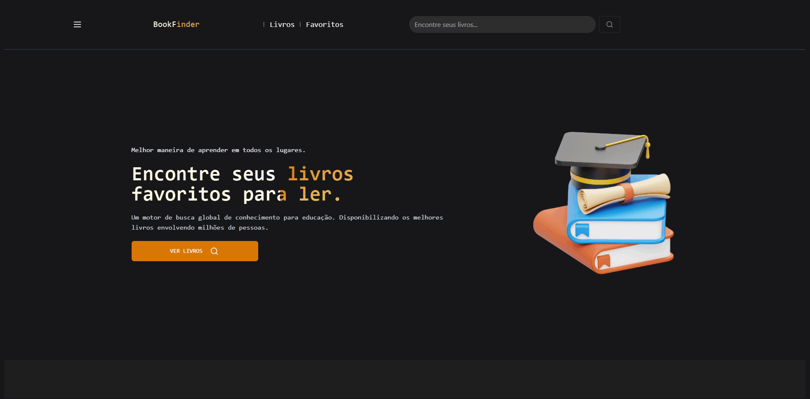

 

<h1 align='center'> Book Finder</h1>

 

 

[Link Para Visualização Do Projeto](https://cloud.google.com/?hl=pt_br)

 

 

Aplicativo web que entrega aos usuários listas de livros, procurar livros pelo nome ou autor e salvar seus livros favoritos.

   

(<a href="#readme-top">Voltar ao topo</a>)

## Funcionalidades
- **Listagem de Livros**: Veja uma lista abrangente de livros.
- **Busca**: Procure por livros pelo nome ou pelo autor.
- **Favoritos**: Salve livros na sessão de favoritos para fácil acesso posterior.

(<a href="#readme-top">Voltar ao topo</a>)

## Techs
* [React](https://ui.shadcn.com/)
* [shadcn](https://ui.shadcn.com/)
* [Lucide](https://lucide.dev/)
* [Google Cloud Platform](https://cloud.google.com/)

(<a href="#readme-top">Voltar ao topo</a>)

##